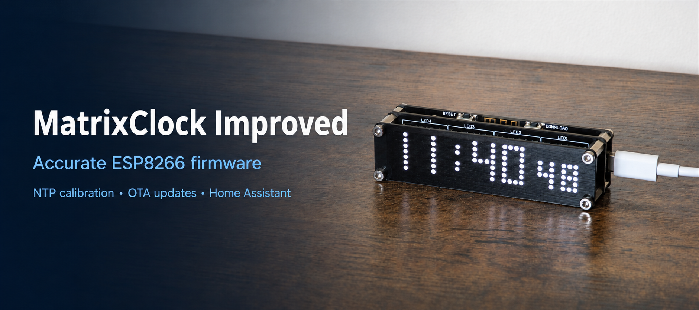

# MatrixClock Improved · v3.1.2

Improved firmware for the HACK LABS MatrixClock, with precision-focused timekeeping through automatic drift calibration, more display control and a clearer local settings page, with Home Assistant messaging.

In everyday use, the clock stays very closely aligned with NTP time, maintaining excellent accuracy between synchronisations.

**Check your hardware first:** this firmware is for the matching **ESP8266 MatrixClock board with 4 MB flash**. It is not a general-purpose firmware for other ESP8266 clocks.

## What improves over the stock firmware?

- **Automatic clock drift calibration using NTP:** learns the ESP8266 clock's fast/slow error and applies a stored correction between synchronisations. The web page shows learning progress and the correction in use.
- **More robust time synchronisation:** checks NTP replies, filters uncertain measurements and retains the last good correction. The battery-backed DS3231 remains available when network time is unavailable.
- **Flexible timezone and DST settings:** choose from 40 regional presets, disable seasonal changes or enter a custom POSIX rule.
- **More display control:** orientation, brightness, separators, animations and date scrolling, with display changes applied without a reboot.
- **Added stopwatch:** normal and hundredths-of-a-second modes, recent results and extended timing, controlled using the clock's existing buttons—no additional hardware required.
- **Multi-function button:** uses the clock's existing button to show the date, enter the stopwatch, start/stop/resume timing, reset a stopped result and return to the clock. It also cancels scrolling messages and provides a warning-protected factory reset. See [button controls](docs/SETTINGS.md#multi-function-button).
- **A rebuilt web interface:** separate settings and live status, a display preview, uptime, NTP diagnostics and calibration information.
- **Home Assistant integration:** send scrolling messages with a selectable number of passes and read the RTC's internal temperature through a local HTTP API.
- **Simpler setup and maintenance:** phone-based Wi-Fi setup, optional web login, factory reset, web firmware updates and configurable restart behaviour.

The calibration corrects the **software clock**, not the DS3231's hardware oscillator. See [timekeeping and settings](docs/SETTINGS.md) for how calibration and RTC backup work.

## Ready to install?

**[Start here: download, update and set up your clock →](docs/INSTALLATION.md)**

No compiling or source editing is needed. Download **`MatrixClock_Improved_v3_1_2_OTA.bin`** from the release assets. The same file supports a web update or a clean USB installation.

- [Latest firmware and checksums](https://github.com/maddenste/MatrixClock-Improved/releases/latest)
- [User manual](MatrixClock_Improved_v3_1_2_User_Manual.pdf)
- [Web interface screenshots](docs/WEB_INTERFACE.md)

## Buying a clock

[Example MatrixClock listing on AliExpress](https://www.aliexpress.com/item/1005005998498827.html).

Seller listings and hardware revisions can change. This is a buying reference, not a guarantee of compatibility: confirm the matching HACK LABS ESP8266 board with 4 MB flash before buying or installing this firmware.

## Make it your clock

Set your Wi-Fi, timezone, NTP provider and display preferences in the browser. The firmware also makes use of the clock's existing buttons for date display, stopwatch control and message cancellation.

For automation, follow the [Home Assistant and API guide](docs/API.md). Keep the clock on a trusted local network: its web interface uses HTTP, not HTTPS. Do not expose it directly to the internet.

## More information

- [Timekeeping, calibration and timezone settings](docs/SETTINGS.md)
- [Changes by version](CHANGELOG.md)
- [Build from source and developer checks](docs/DEVELOPMENT.md)
- [Report a problem](https://github.com/maddenste/MatrixClock-Improved/issues)

## Credits and licence

Based on the original [HACK LABS MatrixClock](https://github.com/hack-apollo/hack_clock) v2.2 package, modified and maintained by Steve Madden. Original attribution remains in the source.

Source and firmware are distributed under [GNU GPL v3](LICENSE), without warranty. Installing firmware is at your own risk.
