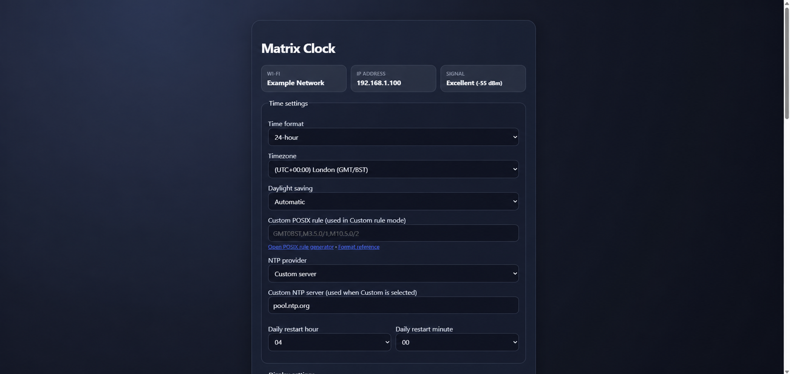
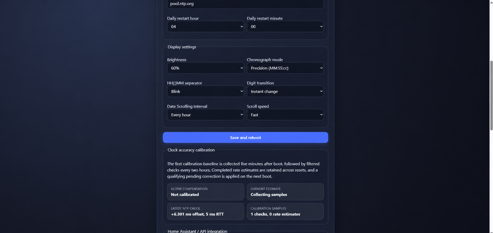
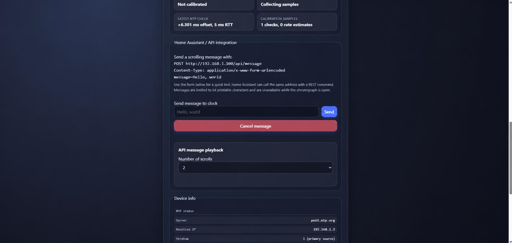

# MatrixClock Improved Firmware v3.0.1

An enhanced public-release firmware for the original HACK LABS MatrixClock
hardware, maintained and extended by Steve Madden. This release is derived
from the HACK LABS MatrixClock v2.2 package and is for the ESP8266-based 4 MB
MatrixClock board only.

The original HACK LABS attribution is retained in the source. This modified
build is licensed under GNU GPL v3; see [LICENSE](LICENSE).

Original project source: [HACK Labs MatrixClock](https://github.com/hack-apollo/hack_clock).

## Release contents

| File | Purpose |
| --- | --- |
| `MatrixClock_Improved_v3_0_1.ino` | Complete corresponding source code. |
| `MatrixClock_Improved_v3_0_1_OTA.bin` | Firmware update file for the clock's web-based OTA update page. |
| `screenshots/` | Public-safe examples of the local web interface. |
| `SHA256SUMS.txt` | SHA-256 integrity check for the v3.0.1 OTA file. |

This is an OTA-only maintenance release. The clean 4 MB recovery image remains
available from the [v3.0.0 release](https://github.com/maddenste/MatrixClock-Improved/releases/tag/v3.0.0).

## Web interface screenshots

Example values are used in these screenshots; they do not show a real Wi-Fi
network, LAN address, or NTP server.

### Time settings



### Display settings and clock calibration



### Home Assistant / API integration



## Important compatibility notes

- Use this firmware only on the matching ESP8266 MatrixClock hardware with
  4 MB flash.
- The OTA file is the tested upgrade path from the original HACK LABS firmware
  on compatible hardware.
- The v3.0.0 full 4 MB factory image overwrites the entire flash. It remains
  the recovery option for a failed OTA update or an unknown/older compatible
  firmware; update it to v3.0.1 through the web OTA page afterwards.
- Neither firmware image should be written to a different ESP8266 product.
- Web authentication and the API are designed for a trusted local network.
  They use HTTP, not HTTPS; do not expose the clock directly to the internet
  or forward its web port. Use a VPN for remote access instead.

## First-time setup

After a clean install, the clock starts its open setup access point:

```text
Wi-Fi name: MatrixClock
Setup address: http://192.168.4.1/
```

Connect a phone or computer to that Wi-Fi network, open the setup address,
choose the home Wi-Fi network, enter its password, and save.
Once the clock reconnects to the home network, open the IP address shown on its
boot-up display. To show the address again, press the hardware reset button to
restart the device.

The normal web interface includes all clock, timezone, NTP, chronograph,
display, API, authentication, calibration, and firmware-update settings.

## Installing the OTA update

`MatrixClock_Improved_v3_0_1_OTA.bin` is an OTA update for compatible
MatrixClock Improved installations. The original v3.0.0 OTA update was tested
from the original HACK LABS firmware on compatible 4 MB ESP8266 MatrixClock
hardware.

1. Find the clock's current IP address.
2. Open `http://<device-ip>/update` in a browser. For example:
   `http://192.168.0.10/update`
3. Sign in using the original default credentials:

   ```text
   Username: nick
   Password: nick
   ```

   If the credentials were changed previously, use the current username and
   password instead.
4. Select `MatrixClock_Improved_v3_0_1_OTA.bin`.
5. Select **Update firmware** and wait for the clock to restart. Do not remove
   power during the update.

The OTA page must never be given the 4 MB factory image.

## Clean recovery install over USB

Use the v3.0.0 factory image when the clock cannot be reached over the web
interface, or when a completely clean installation is wanted. Once recovered,
install the v3.0.1 OTA file through the web interface.

1. Install or download [Espressif esptool](https://github.com/espressif/esptool/releases).
   Its official [ESP8266 command documentation](https://docs.espressif.com/projects/esptool/en/latest/esp8266/esptool/basic-options.html)
   explains drivers and serial-port selection.
2. Connect the MatrixClock by USB and close Arduino Serial Monitor or any
   other program using the COM port.
3. Replace `COM3` below with the clock's Windows COM port:

```cmd
esptool --chip esp8266 --port COM3 --baud 115200 --before default_reset --after hard_reset write_flash -z --flash_mode dio --flash_freq 80m --flash_size 4MB 0x0 MatrixClock_Improved_v3_0_0_Factory_4MB.bin
```

The factory image already covers the whole flash, so a separate `erase_flash`
command is not required before writing it. It will erase all existing firmware,
Wi-Fi data, settings, and saved calibration information.

## Original firmware archive

`HACK_LABS_MatrixClock_v2_2_Original_Archive.rar` is supplied as an optional
release asset. It is an unmodified archive of the original HACK LABS MatrixClock
v2.2 package, included for provenance, reference, and optional rollback only.
It contains the original source, firmware binaries, hardware files, README, and
GPL v3 license.

It is not required to install or use MatrixClock Improved Firmware v3.0.1.

## Building from source with Arduino IDE

This release was built using Arduino IDE with the ESP8266 board package 3.1.2.

Use these build settings:

```text
Board:          NodeMCU 1.0 (ESP-12E Module)
CPU frequency:  80 MHz
Flash size:     4 MB
Flash mode:     DIO
Upload speed:   115200
```

1. Install the ESP8266 boards package if it is not already present.
2. Open `MatrixClock_Improved_v3_0_1.ino` from its matching folder.
3. Select **Tools > Board > ESP8266 Boards > NodeMCU 1.0 (ESP-12E Module)**.
4. Select the clock's serial port.
5. Ensure the board is configured for 4 MB flash, then use **Verify** or
   **Upload**.

The libraries used by this sketch (`SPI`, `Ticker`, `ESP8266WiFi`,
`ESP8266WebServer`, `EEPROM`, `WiFiUdp`, `Wire`, and `time`) are provided by
the ESP8266 board package; no separate library downloads are required.

## API quick start

The web page shows the current API address. In the examples below,
`CLOCK-IP` means the clock's current LAN IP address, shown on the clock during
startup and on its web page. A DHCP lease can change this address after a
reboot. For reliable Home Assistant use, reserve a fixed address for the clock
in the router (DHCP reservation/static lease), then use that address in the
API configuration. To send a message from a system on the same network, make a
form-encoded HTTP POST request:

```text
POST http://CLOCK-IP/api/message
Content-Type: application/x-www-form-urlencoded

message=MatrixClock v3.0.1&scrolls=2
```

If web security is enabled, include the MatrixClock username and password.
PowerShell can prompt for them without putting the password in your command
history:

```powershell
$credential = Get-Credential
Invoke-WebRequest `
  -Uri "http://CLOCK-IP/api/message" `
  -Method POST `
  -Credential $credential `
  -ContentType "application/x-www-form-urlencoded" `
  -Body "message=MatrixClock v3.0.1&scrolls=2"
```

For Home Assistant, store the credentials in `secrets.yaml` and use a REST
command:

```yaml
rest_command:
  matrixclock_message:
    url: "http://CLOCK-IP/api/message"
    method: POST
    username: !secret matrixclock_username
    password: !secret matrixclock_password
    content_type: "application/x-www-form-urlencoded"
    payload: "message={{ message }}&scrolls={{ scrolls | default(1) }}"
```

Call it with a service action such as:

```yaml
action: rest_command.matrixclock_message
data:
  message: "Bin day tomorrow"
  scrolls: 2
```

Leave the MatrixClock username and password blank to disable web security; in
that case the API does not require credentials. Messages are local-network
only, use HTTP rather than HTTPS, and are unavailable while the chronograph
is open. They can be cancelled from the clock's web page or physical button.

## Verify downloaded files

On Windows, run this from the release folder:

```cmd
certutil -hashfile MatrixClock_Improved_v3_0_1_OTA.bin SHA256
```

Compare the result with `SHA256SUMS.txt`. The corresponding source is
maintained in this repository.

## Licence and attribution

The original HACK LABS MatrixClock notices remain in the source header. The
complete modified source and any distributed firmware binaries are released
under GNU GPL version 3. See `LICENSE` and `CHANGELOG.md`.

This project is provided without warranty. Flashing firmware is undertaken at
your own risk.
