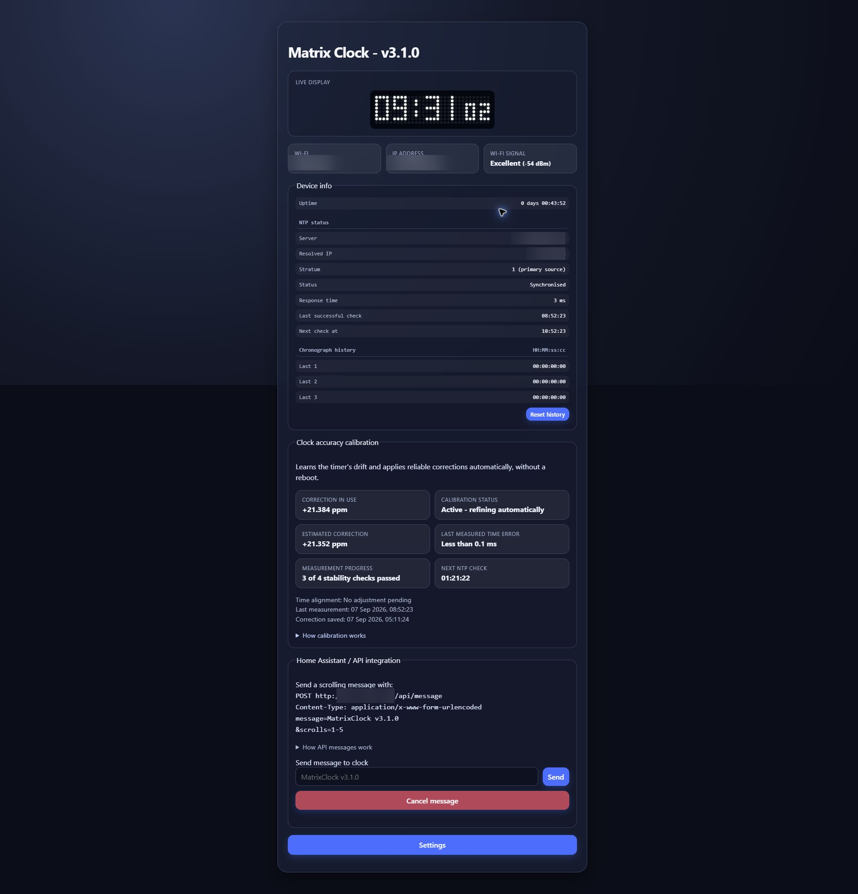
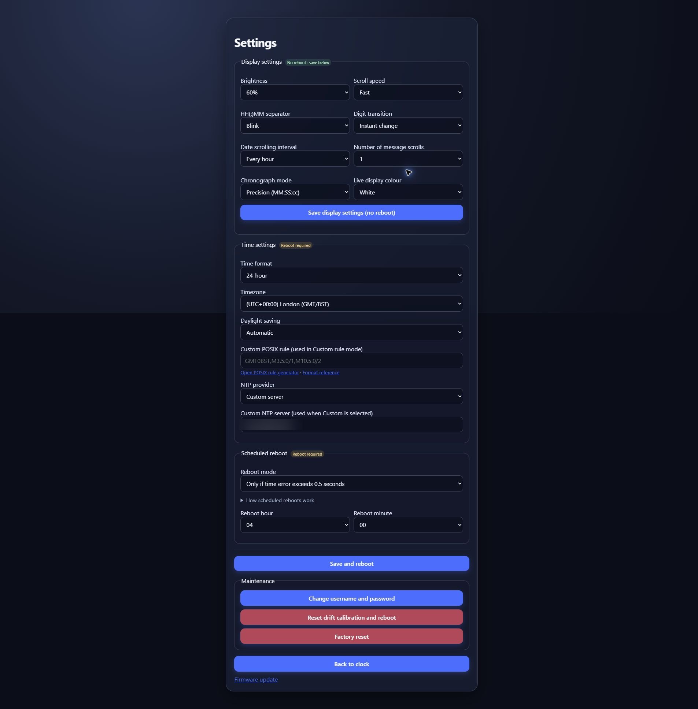
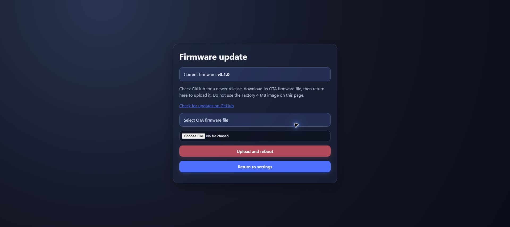

# Web interface

[Back to the project](../README.md)

These screenshots were captured from a running v3.1.0 clock. Their interface
layout remains representative of v3.1.2. Network-specific values have been
blurred for privacy; calibration figures and selected settings are examples
from that installation and will differ on another clock. No passwords or web
authentication credentials are shown.

### Main page: live status, calibration and API messaging

### Settings page

### Firmware update page

